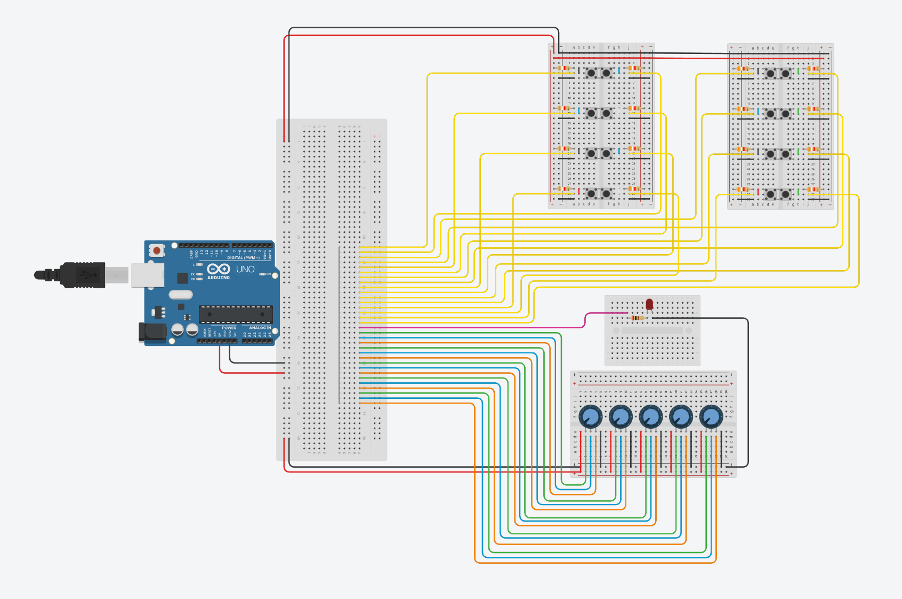

# dcs-bios-universal-panel
A repo to hold all my Arduino code for my DCS panel

# Overview
The goal of this project is to make a Arduino that connects to the game DCS World.
For output a simple 16x2 lcd is used.
For input a combination of 16 buttons, one LED and 5 KY-040 Rotary Encoders are used.
The plan is to put all the hardware in a box so that it can be easily stored/used. This will also include a PCB to connect everything to the Arduino Mega.

Much of this project is still in Dutch and will be translated to English over time.

I have made a basic layout of the final cable layout design, this is work in progress and an electronic diagram will be added the future.

The number on the breadboard that the cable conntects to is what port the cable is connected to on the Arduino Mega.

The version of dcs-bios I have is modified to use dynamic inputs, wich was made by [Blue73](https://forum.dcs.world/topic/197601-dcs-bios-dynamic-mapping-based-on-aircraft-type-code/). Extra modifications I have made to this will also allow Encoders to also use dynamic decArg & incArg. If needed I also plan to make a modification of the led class to also accept dynamic output, will probably end up using something from [this thread](https://forum.dcs.world/topic/269903-dcs-bios-arduino-code-for-switching-between-modules/?tab=comments#comment-4645082).

## How to use
In terms of usability, a lot of inspiration is taken from the Youtube video from [John Gardner](https://www.youtube.com/watch?v=bt69aoobHJ8).
Controlling the display is pretty straitforward, the only thing you have to remember is what action each key has in wich profile.
Controlling what profile is currently used is based on 2 things: first is what aircraft is currently being used, this is checked in the program itself and information about this is recieved by the game itself; Second is the Encoder 5, this one controls what submenu is currently selected, the current submenu is also displayed at the top right of the lcd.

## Program overview
Here I will briefy explain what happens in the code when the program is running, this is to help anyone understand my code in case you want to use it.

### Before startup
#### Defining controls
I define all my controlles used as you would normally with DCS-bios, execpt that I use "UNDEF" as the control to use. This means that noting will happen when that control is used.
Then all the different controll layouts are defined. Each layout is an object of the "controllayout_type" struct.
This struct hold a array of all the control names for that layout, as well as a method for making the controls in the layout as active.
The different objects are defined below where the struct is defined, next to them is also the list for that layout which is given as the parameter for that layout.
This will allow us to make a layout active by calling its name and using the ".MakeCurrent()" method to make that layout active.

#### Outputs
Next up all the outputs are defined as you normally would with DCS-bios.
I do have some where I check the current encoder position (In case I only want the output to show up on a specific page).
Or where I check my current plane id (If it's a generic output shared by multiple planes).

### Setup and loop
#### Setup
Setup is pretty simple, I only startup my display and then I start the DCS-bios library.
I also draw the current submenu here to give feedback that the program has started.

#### Loop
Two main things happen in the loop.
First is the DCS-bios loop, this in encased in a if loop so that it can be stopped when the controls are being changed.
(not sure if stopping this wen updating the controls is really needed, but the person who shared the dynamic mapping has this, so I'm also using it)
Second thing inside the loop is the code to change the encoder position, I got this from the [KY-040.pdf manual](https://github.com/EwoutHeb/dcs-bios-universal-panel/blob/6677d9c47476b7e54bfb288776d1d91baec5fe77/files/KY-040%20manual.pdf).
When it is found that the encoder has moved, it will increase the current encoder position respectively and call the "submenuChange()" function to update the current control layout. More on what happens in this method can be found below in "Changing submenu" section.

### Changing controls
#### Changing aircraft
Detection of aircraft changed is by DCS-bios using the "AcftNameBuffer" output, it runs every time the current aircraft is changed and gives the name of new aircraft.
When excecuted the lcd wil be cleared and the program will check what new aircraft is selected. Once the new aircraft is found it will reset the encoder position back to 1 and change the aircraft id and maximum amount of submenus accroding to that plane.
Next it will call the same "submenuChange()" function that is also called when the encoder position is changed and explained in the next section.

##### List of ID's
(list will get updated as more are added)
- -1: FC3 aircraft
-  0: no aircraft (or one that is not implemented, default case)
-  1: A-10CII (will probably work with the old A-10C)
-  2: AJS-37
-  3: Mi-8MTV2
-  4: F-14B (will probably work with the F-14A)

#### Changing submenu
This will be more about explaining what happens inside the "submenuChange()" method and not how we got here, for that read sections above at "Changing aircraft" & "Loop".
First thing inside this method is checking if the current encoder position is a valid value, checking of valid value is not done inside the Loop. The current submenu is also redrawn here.
Next, it is checked what plane is currently in use by comparing the id (sidenote for anyone atempting the same: I tried using the same string method as used inside the aircraft change event, but that did not work), List of ID's can be found above at "List of ID's"
Then it is checked what current submenu is currently selected, for most planes this is as simple as calling the control name and calling the ".MakeCurrent()" method.
For the A-10C however, I'm also printing the name of the current submenu in the topleft of the display.
If a aircraft is used that is not yet implemented or is a FC3 plane, it wil use the default (empty) layout for the controls.

